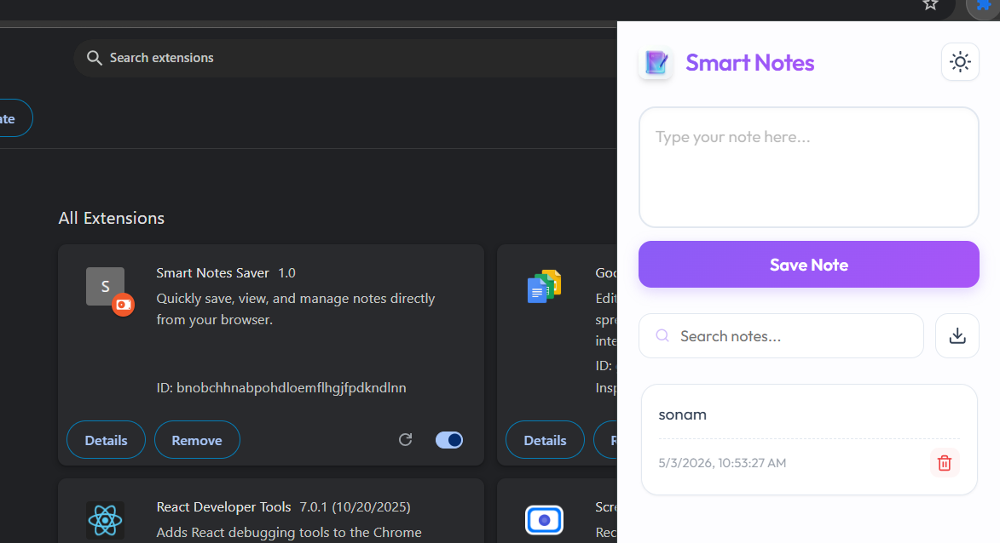
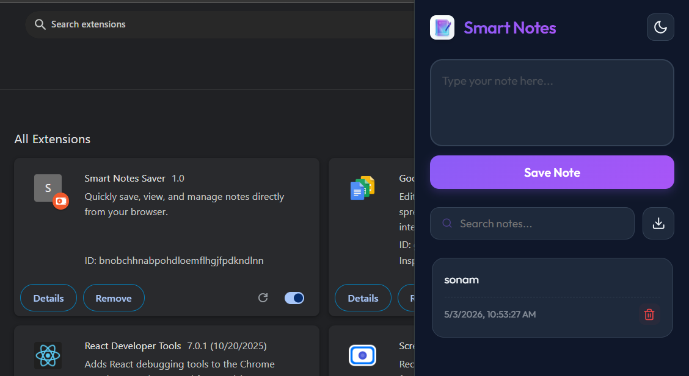

# 📝 Smart Notes Saver - Chrome Extension

**Smart Notes Saver** is a premium, lightweight, and highly productive Chrome Extension that allows you to capture ideas, save important snippets, and manage your tasks directly from your browser without losing focus.

---

## 📸 Screenshots

| Light Mode | Dark Mode |
|------------|-----------|
|  |  |

---

## ✨ Key Features

- 🚀 **Instant Note Taking:** Save your thoughts instantly with a single click.
- 🌓 **Dynamic Dark Mode:** A beautiful, eye-friendly dark theme that persists across sessions.
- 🔍 **Real-time Search:** Instantly find your notes as you type.
- 💾 **Reliable Storage:** Uses `chrome.storage.local` to ensure your notes are safe even after browser restarts.
- 📥 **Export to Text:** One-click download of all your notes as a professional `.txt` file.
- ✨ **Glassmorphism UI:** A modern, sleek design with smooth animations and high-quality aesthetics.
- 🗑️ **Easy Management:** Delete individual notes with a simple hover-and-click action.

---

## 🛠️ Installation Guide

Follow these simple steps to install the extension in your browser:

1. **Download/Clone** this repository to your local machine.
2. Open **Google Chrome** and navigate to `chrome://extensions/`.
3. Enable **"Developer mode"** using the toggle in the top-right corner.
4. Click on the **"Load unpacked"** button.
5. Select the folder containing these files.
6. **Pin the Extension:** Click the puzzle icon 🧩 in your browser toolbar and pin **Smart Notes Saver** for quick access.

---

## 🚀 How to Use

1. Click on the **Smart Notes** icon in your browser toolbar.
2. Type your note in the provided text area.
3. Click **Save Note** to add it to your list.
4. Use the **Search Bar** to filter notes.
5. Toggle the **Sun/Moon icon** to switch between Light and Dark modes.
6. Click the **Download icon** to export all notes to a text file.

---

## ⚙️ How it Works (Workflow)

- **Popup Interaction:** When you click the extension icon, `popup.html` is rendered. The `popup.js` script immediately initializes and checks for existing notes in the storage.
- **Data Persistence:** Notes are stored using the **Chrome Storage API** (`chrome.storage.local`). This ensures that your data is saved locally in the browser and persists even if you close the browser or restart your computer.
- **Dynamic UI:** JavaScript's `DOMContentLoaded` event ensures the UI is ready before any logic runs. When a note is saved, the DOM is updated dynamically without refreshing the popup.
- **Dark Mode Logic:** The theme preference is also saved in the storage. When the popup opens, it reads the `darkMode` boolean and applies the correct CSS class to the `<body>` element.
- **Export Functionality:** The export feature creates a `Blob` object from your notes array and uses a temporary anchor (`<a>`) tag to trigger a download of a `.txt` file.

---

## 💻 Tech Stack

- **Frontend:** HTML5, CSS3 (Vanilla CSS)
- **Logic:** JavaScript (ES6+)
- **API:** Chrome Extensions API (Manifest V3)
- **Storage:** `chrome.storage.local`
- **Design:** Glassmorphism, Responsive UI

---

## 📜 License

This project is open-source and available under the [MIT License](LICENSE).

---

*Made with ❤️ for productivity.*
